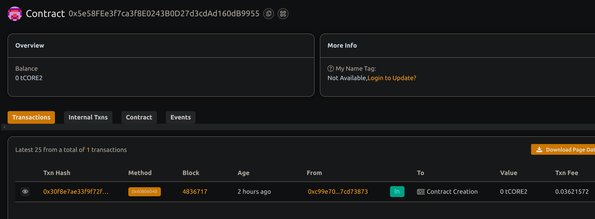

# BasicAttendanceTracking

## Project Description
BasicAttendanceTracking is a simple decentralized system to create events and track attendance on the blockchain. It allows event organizers to register events, and attendees to mark their presence transparently and immutably.

## Project Vision
To build a trustless attendance tracking platform that eliminates manual errors, fraudulent attendance claims, and central authority control by leveraging blockchain technology.

## Key Features
- Create events with name, date, and organizer information
- Mark attendance by attendees after event start time
- Query attendance status for any attendee
- Transparent and immutable attendance records on-chain

## Future Scope
- Integration with identity verification to prevent fake attendance
- QR code or NFC-based check-in systems linked with the smart contract
- Attendance rewards or incentives for participants
- Analytics dashboard for event organizers to monitor participation

## Contract details
0x5e58FEe3f7ca3f8E0243B0D27d3cdAd160dB9955
